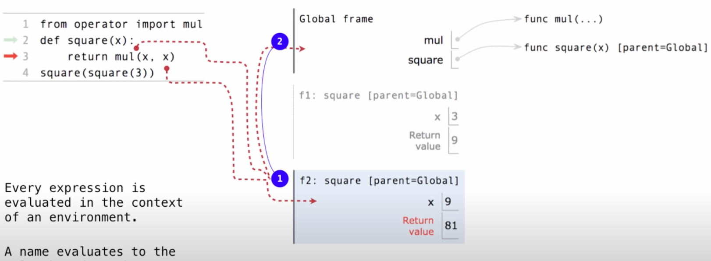

# CS61A Berkly 2023 Fall

Some important points

## Higher-Order Functions

**Functions are first Class**: Functions can be manipulated as values in our programming language.

**High-order function**:A function that takes a function as an argument value or returns a function as a return value

High-order function:

* Express general methods of computations
* Remove repetition from programs
* Seperate concerns among functions

## Multiple environment

An environment is a sequence of frames.

* The global frame alone
* A local, then the global frame

Every expression is evaluated in the context of an environment.

A name evaluated to the value bound to that name in the earlist frame of the current environment in which that name is found

​​

Name has no meaning without the environment

A call expression and the body of the function being called are evaluated in different environments. 

## Statements

A statement is executed by the interpreter to perform an action.

*Compound Statement*

 ​​

A suite is a sequence of statement.

To "execute" a suite means to execute its sequence of statements, in order

**Execution Rule for a sequence of statements**:

* Execute the first statement
* Unless directed otherwise,execute the rest

**Execution rule for conditional statements**:

1. Evaluate the header's expression.
2. If it is a true value,except the suite&skip the remaining clauses.

**Syntax Tips**

1. Always starts with "if " clause.
2. Zero or more "elif" clauses.
3. Zero or one "else" clause,always at the end.

**Execution Rule for While Statements:**

1. Evaluate the header's expression.
2. If it's a true value,execute the suite, then return to step 1.

​​

The parent of any function (including lambdas) is always the frame in which the function is defined. It is useful to include the parent in environment diagrams in order to find variables that are not defined in the current frame. In the previous example, when we call `delete_two`​ (which is really the lambda function), we need to know what `x`​ is in order to compute `y // (10 ** x)`​. Since `x`​ is not in the frame `f2`​, we look at the frame’s parent, which is `f1`​. There, we find `x`​ is bound to 2.

As illustrated above, higher order functions that return a function have their return value represented with a pointer to the function object.

All the expressions that not be indented should be evaluated in global frame.  
`A lambda function's parent is the current frame in which the lambda expression is evaluated. `​

​​

## Return

A return statement completes the evaluation of a call expression and provides its value f(x) for user-defined function f: switch to a new environment;execute f's body.

return statement within f: switch back to the previous environment ; f(x) now has a value.Only one return statement is ever executed while executing the body of a function

## The Recursive leap of faith

**Is **​**fact** ** implemented correctly**?

1. Verify the base case.
2. Treat fact as a functional abstruction
3. Assume that fact(n-1) is correct
4. Verify that fact(n) is correct assume that fact(n-1) correct

## Some interesting problem

1. The first is about the prime :

    ```python
    def div_by_primes_under(n):
        def checker(x):
            return False
        i = 2
        while i<=n:
            if not checker(i):
                def outer(func,i): # line 7 <- line that just executed
                    def inner(x): # line 8 <- current line in the debugger
                        return x%i==0 or func(i)
                    return inner
                checker = outer(checker, i) # line 11
            i = i+1
        return checker
    div_by_primes_under(10)(11) # line 14
    ```
    The answer that given by AI:

    The code is currently inside the**`outer`**​​**function, which was called at line 7. The purpose of the** **`outer`**​​ ** function is to create and return the** **`inner`**​​ ** function, which checks if a given number is divisible by the current value of** **`i`**​​ ** or any of the previous prime numbers. The** **`inner`**​​ ** function checks if a number is divisible by the current value of** **`i`**​​ ** or any of the previous prime numbers using the modulo operator. This is done by using a closure, which allows the** **`inner`**​​ ** function to remember the value of** **`i`**​​ ** from the** `outer`​​ function's scope.

    At this point, the**`outer`**​​ ** function is being called with the** `checker`​​ ** function and the current value of** **`i`**​​ ** as arguments. It then creates and returns the** **`inner`**​​ ** function, which will be used to check for divisibility by the current value of** `i`​​ or any of the previous prime numbers.

    Overall, the code is implementing a method to check if a number is divisible by any prime numbers less than or equal to a given value`n`​​.
2. The**`checker`**​​ ** function is initially defined to always return** **`False`**​​ **, and** **`i`**​​ ** is initialized with the value 2. In the context of the** `div_by_primes_under`​​ function, these lines are setting up the initial state for the prime number checking process.

    The**`checker`**​ ** function is used to keep track of the discovered prime numbers. Initially, it returns** `False`​ for any input, indicating that no prime numbers have been discovered yet.

    The variable**`i`**​​ ** is used to iterate through the numbers from 2 up to the given value** `n`​​. It starts with the value 2 because 2 is the first prime number.

    These initializations set the stage for the subsequent logic to find prime numbers and use them to check divisibility in the`div_by_primes_under`​ function.
3. 这个题目的理解方式比较特别：

    1. 最上面的`check(x): return False `​是为了保证每一次在对新的i进行`x%i`​操作时，前面的数字没有满足prime条件的。
    2. 中间的outer和inner函数，对于每一个不同的i值，都会有对应的outer和inner函数被创造出来。  
        ​`checker=outer(checker,i)->inner->i=i+1->inner(i+1)->(i+1)%i or checker(i)->inner(i)->inner(i-1)...checker(x): return False`​
    3. 在使用inner函数中` return x%i==0 or func(i) `​语句时，前面的是为了确定当前的数字满不满足条件，第二个是为了确定以前的数字满不满足条件。
    4. 由于本题限定了必须使用high-order function的写法，不然其实用循环会更简单。但实际上，这题就是希望用high-order function来实现循环的效果，不过写出来的东西很抽象。
    5. 推荐使用pythontutor来看一下这个函数的运行过程。[pythontutor](https://pythontutor.com/)​
